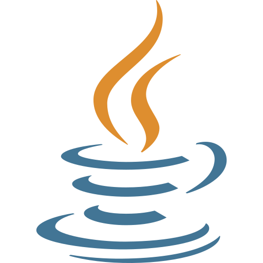

# Hi there 👋 My name is Ryan.

I am an aspiring Data/Financial Analyst. Passionate about solving complex problems and placing myself in situations where I can take on challenges. 

### 🌱 Courses I am currently taking
- [Python for Financial Analysis and Algorithmic Trading on Udemy](https://www.udemy.com/course/python-for-finance-and-trading-algorithms/)
- [Harvard's CS50 Introduction to Computer Science](https://pll.harvard.edu/course/cs50-introduction-computer-science)
- [Data Science and Machine Learning Bootcamp with R on Udemy](https://www.udemy.com/course/data-science-and-machine-learning-bootcamp-with-r/)

## Languages and Tools
 

<!--
**rdang4/rdang4** is a ✨ _special_ ✨ repository because its `README.md` (this file) appears on your GitHub profile.

Here are some ideas to get you started:

- 🔭 I’m currently working on ...
- 🌱 I’m currently learning ...
- 👯 I’m looking to collaborate on ...
- 🤔 I’m looking for help with ...
- 💬 Ask me about ...
- 📫 How to reach me: ...
- 😄 Pronouns: ...
- ⚡ Fun fact: ...

-->
